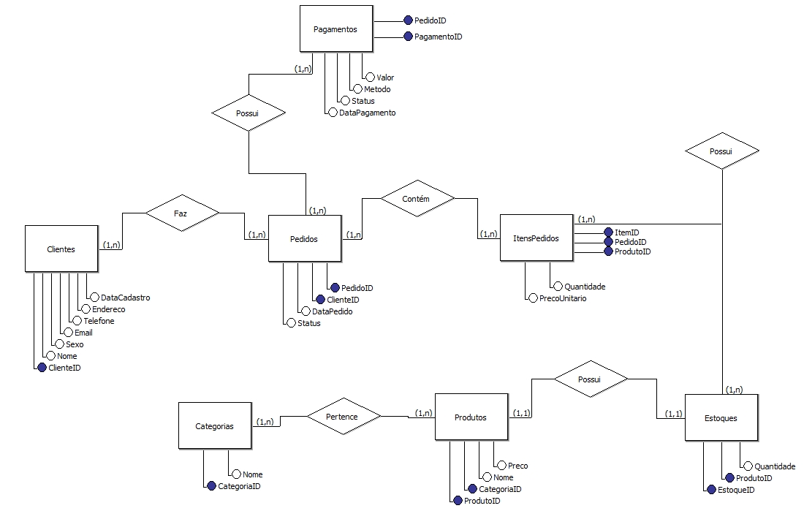

# 🛒 Loja Online – Banco de Dados SQL

## 📖 Sobre o Projeto
Este é um projeto acadêmico de **modelagem e implementação** de um banco de dados para um **e-commerce**, desenvolvido em **MySQL**.  
O objetivo é simular o funcionamento de uma loja online, contemplando **clientes, produtos, pedidos, pagamentos e estoque**.

---

## 📊 Modelagem do Banco de Dados
A modelagem foi feita no **BRModelo**, representando de forma clara e eficiente o fluxo de uma loja virtual.  

  
> *Imagem ilustrativa do modelo entidade-relacionamento (ER) exportado do BRModelo.*

---

## 🗂️ Estrutura das Tabelas
O banco de dados contém as seguintes entidades:

- **Clientes** – dados pessoais, endereço e contato dos clientes.  
- **Categorias** – classificação dos produtos.  
- **Produtos** – catálogo de itens disponíveis.  
- **Pedidos** – registros das compras realizadas.  
- **ItensPedido** – produtos vinculados a cada pedido.  
- **Pagamentos** – informações de transações financeiras.  
- **Estoque** – controle de quantidade de produtos disponíveis.  

---

## ⚡ Scripts SQL
Arquivo principal: [`LojaOnline.sql`](LojaOnline.sql)

O script inclui:  
✅ Criação do banco de dados e tabelas  
✅ Inserção de dados fictícios para testes  
✅ Consultas SQL para análise, como:  
- Produtos mais vendidos  
- Total gasto por cliente  
- Estoque de produtos disponíveis  

###🚀 Tecnologias Utilizadas

MySQL – Banco de dados relacional

BRModelo – Modelagem do banco de dados

MySQL Workbench / DBeaver – Execução de scripts e testes

✍️ Autor

Vinicius Souza Martins
🔗 LinkedIn
